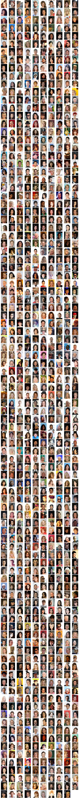

# WWZD API
## Przed uruchomieniem
~~Musicie pobrać plik data.7z (link na messengerze) i wypakować go.
Jeśli będziecie odpalać plik docker-compose.yaml, to musi znajdować się w tym samym katalogu. Jeśli ręcznie budujecie obraz i odpalacie samym dockerem, to musicie odpowiednio podać ścieżkę absolutną do folderu i zamontować w kontenerze na ścieżce ``/data``.~~

Musicie pobrać plik data.7z (link na messengerze) i wypakować go do ``src/data``.

Wizualizacja:
```
src/
  data/
    pickles/
      wwzd_not_cropped_new_cpu.pickle
    tilemaps/
      tilemap-000.jpg
      ...
  app.py
  Dockerfile
  ...
docker-compose.yaml
```

Obraz może ważyć około 4-5 GB.
## Uruchomienie
Najprościej przez docker-compose:
``` bash
docker-compose -f docker-compose.yaml up
```

Jak pojawi się aktualizacja, to trzeba wywołać:
``` bash
docker-compose -f docker-compose.yaml build
```

Więcej [tutaj](https://docs.docker.com/engine/reference/commandline/cli/) i [tutaj](https://docs.docker.com/compose/)

Pierwsze budowanie może trwać długo, w zależności od prędkości internetu. Każde kolejne powinno trwać krótko, chyba, że zostaną dodane nowe zależności w ``src/Pipfile``.

Serwer nasłuchuje na porcie 5000, więc wszelkie zapytania trzeba wysyłać na ``http://localhost:5000``. Jeśli ten port wam nie odpowiada, to możecie zmienić w ``docker-compose.yaml``:
``` yaml
services:
  wwzd_api:
    build: src/
    ports:
      - {port_hosta}:5000
    volumes:
      - ./data:/data
```
## Zajętość
Jeśli serwer jest aktualnie zajęty przetwarzaniem jakiegoś zapytania (UMAP może trwać nawet kilka minut), to zwróci odpowiedź HTTP 503
``` json
{
  "error": "Server is busy, please wait"
}
```

## Endpointy
### ``GET /status``
Zwraca status. Jeśli serwer nie jest zajęty, to zwraca HTTP 200:
``` json
{
  "busy": false
}
```

### ``GET /dataset/info``
Zwraca informacje o datasetcie, a konkretnie ilość zdjęć i id zakresów. Dataset jest podzielony na zakresy do 1000 zdjęć. Dla każdego takiego zakresu jest jedna tilemapa.

000: 1-999
001: 1000-1999
002: 2000-2999
...
202: 202000 - 202500

Przykładowa odpowiedź:
``` json
{
  "total": 202500,
  "ranges": {
    "000": [1, 999],
    "001": [1000, 1999],
    "002": [2000, 2999],
    ...
    "202": [202000, 202500] 
  }
}
```

### ``GET /tilemaps/{id}``
Zwraca plik graficzny z tilemapą dla zakresu o podanym ``id``.

Np. ``id = 000``



Tilemapy mają tile o rozmiarach 48x48, ale zdjęcia nie są kwadratowe, więc wysokość jest 48px a szerokość inna.

Tilemapy należy odczytywać linijka po linijce, od lewej do prawej.

### ``POST /pca/{start}/{end}``
Endpoint przyjmuje parametry ``start`` i ``end``, które są początkowym i końcowym id zakresu. Czyli np. ``/pca/0/9`` zwróci nam wyniki dla zdjęć 1-9999 z datasetu + zdjęcie wysłane przez użytkownika.

Treścią zapytania musi być ``multipart/form-data``, a plik musi znajdować się pod kluczem ``file``. Zdjęcie nie będzie wysyłane spowrotem, jest tylko zapisywane na serwerze w katalogu ``/tmp`` na potrzeby przetwarzania. Aplikacja kliencka musi samemu wczytać zdjęcie do canvasa czy czegoś innego.

Endpoint w odpowiedzi zwraca zredukowany metodą PCA wektor cech ze zbioru i zdjęcia użytkownika. Najpierw są wektory dla zdjęć z datasetu, a ostatnim elementem jest wektor dla zdjęcia przesłanego przez użytkownika.

Endpoint zwraca także listę id tilemapów, na którym są zdjęcia z podanych zakresów.

Przykładowa odpowiedź:
``` json
{
  "features": [
    [
      -1.4914852380752563,
      -9.041833877563477,
      5.840154647827148
    ],
    [
      9.578680038452148,
      -1.2674076557159424,
      5.192427158355713
    ],
    [
      -0.7366667985916138,
      7.462055206298828,
      -0.23945428431034088
    ],
    ...
  ],
  "tilemap_ids": [
    "000",
    "001"
  ],
  "total": 1999 // 998 (000) + 1000 (001) + 1 (plik) 
}
```

### ``POST /umap/{start}/{end}``
Analogicznie jak dla PCA, tylko zwraca wyniki dla UMAP. To zapytanie może trwać nawet kilka minut.